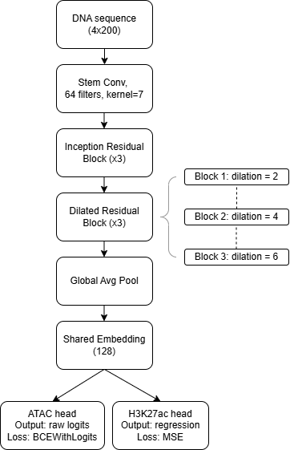
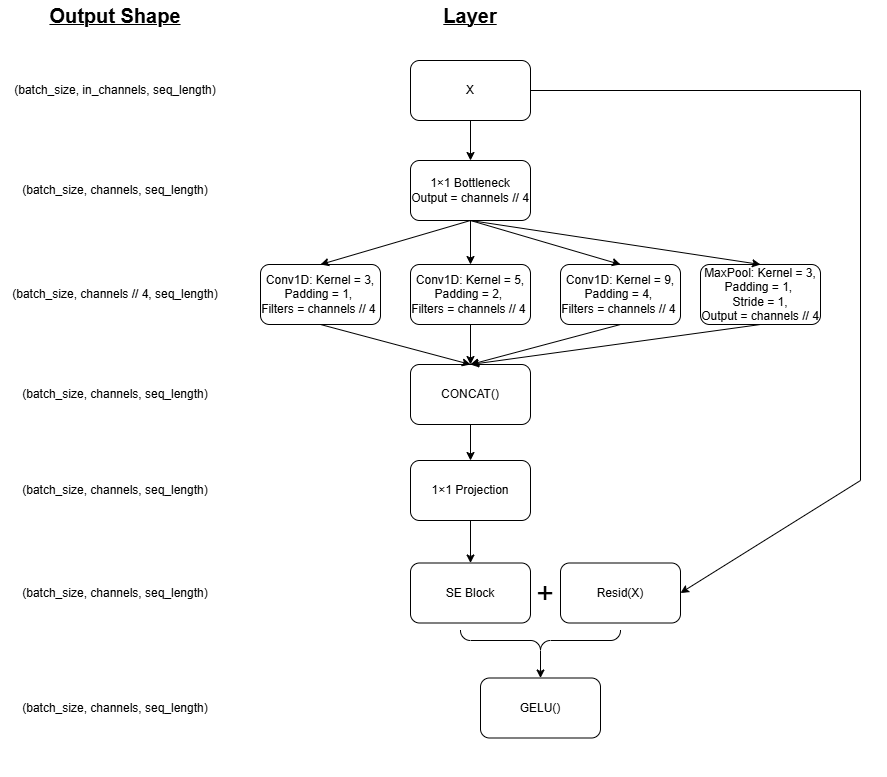
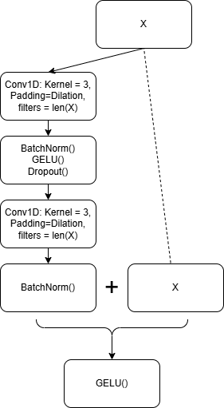
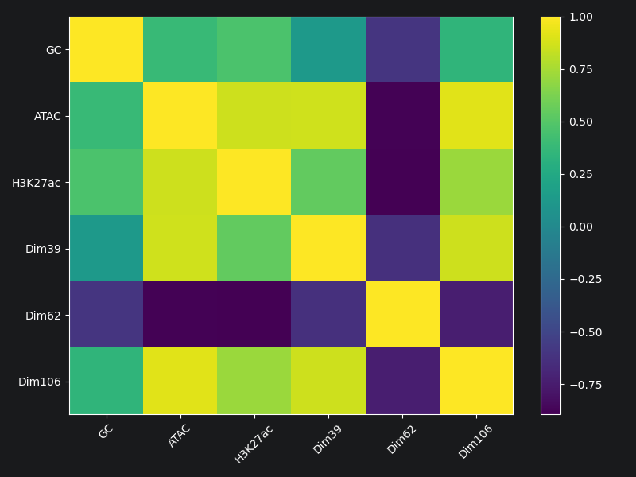
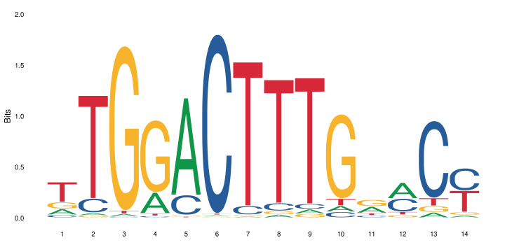

# RegulatoryResNet: Multi-Task Prediction of Chromatin Accessibility and Histone Activity from DNA Sequence

## Overview

RegulatoryResNet is a deep learning framework for predicting regulatory activity directly from genomic DNA sequence.

The model jointly predicts:

Chromatin accessibility (ATAC-seq) and Histone H3K27ac activity,

using a shared sequence representation learned from raw one-hot encoded DNA.

Unlike many modern genomics pipelines that rely on pretrained foundation models, this project trains a task-specific architecture from scratch and investigates whether biologically meaningful regulatory features emerge within the learned embedding space.

## Motivation

Gene regulation is controlled by sequence-dependent interactions between transcription factors, chromatin accessibility, and epigenetic modifications.

This project explores three questions:

Can accessibility and histone activity be predicted directly from DNA sequence?

What architectural choices are most effective for short regulatory sequences?

Do interpretable biological signals emerge within the learned latent representation?

## Raw Data

### ATAC-seq
ATAC-seq experiments from HepG2 liver carcinoma cells were used to define accessible chromatin regions. Peak regions were treated as positive examples for accessibility prediction.

**Biological context:** HepG2 liver cell line

**Source:** ENCODE Consortium

### H3K27ac ChIP-seq
H3K27ac ChIP-seq measurements from HepG2 cells were used as a quantitative proxy for enhancer and promoter activity. These values served as the regression target in the multi-task learning framework.

**Biological context:** HepG2 liver cell line

**Source:** ENCODE Consortium

### Reference Genome
DNA sequences corresponding to positive and negative regions were extracted from the human reference genome (hg38). GC-matched negative examples were sampled from the reference genome to reduce trivial sequence composition biases.

**Source:** Genome Reference Consortium hg38

### STARR-seq MPRA Dataset
A STARR-seq MPRA dataset generated in a liver context was used exclusively for downstream interpretation of learned representations. Correlations between MPRA activity and latent embedding dimensions were used to identify biologically meaningful sequence features and recover known transcription factor binding motifs.

**Biological context:** Liver regulatory elements

**Source:** GEO accession GSE293971

## Dataset Construction

Positive examples were derived from experimentally measured regulatory regions.

To avoid trivial classification based on nucleotide composition alone, negative sequences were generated from the reference genome (hg38.fa) and matched to positive regions by GC content.

Additional preprocessing steps included:

- One-hot encoding of DNA sequence
  
- Reverse-complement augmentation
  
- Multi-task label generation
  
- Train/validation splitting with fixed random seeds
  
- This resulted in a balanced dataset suitable for both classification and regression objectives.

## Model Architecture
The final architecture combines ideas from Inception networks, residual learning, and channel attention mechanisms.

   
  <em>RegulatoryResNet Model architecture.</em>

### Stem

A convolutional stem converts one-hot encoded DNA into a (64-dim) learned feature representation. 

In the model, this implemented as Conv1D (kernel size: 7, padding: 3) layer followed by batchnorm1D, and finally GELU().

### Inception-Residual Blocks

   
  <em>Inception-Residual Block Structure.</em>

#### Three Inception-style residual blocks operate in parallel using multiple receptive fields:

- 3 bp convolutions (1x1 Conv, BatchNorm, GELU, Conv1d with **kernel size: 3** to recognize **short** motifs, BatchNorm, GELU)

- 5 bp convolutions (1x1 Conv, BatchNorm, GELU, Conv1d with **kernel size: 5** to recognize **medium-length** motifs, BatchNorm, GELU)

- 9 bp convolutions (1x1 Conv, BatchNorm, GELU, Conv1d with **kernel size: 9** to recognize **long** motifs, BatchNorm, GELU)

- pooled context branch (MaxPool, 1x1 Conv, BatchNorm, GELU)

Outputs are concatenated, projected through a 1×1 convolution, recalibrated using a Squeeze-and-Excitation (SE) block (see diagram below), and merged through a residual connection.
This allows the model to capture regulatory patterns at multiple sequence scales.

   
  <em>Squeeze-and-Excitation (SE) Block Structure.</em>

### Dilated Residual Blocks

   
  <em>Dilated Residual Block Structure.</em>

Three additional residual blocks use dilated convolutions with dilation rates:

- 2

- 4

- 8

to increase receptive field size without increasing parameter count.

### Shared Regulatory Embedding

Global average pooling produces a compact sequence representation.

A shared MLP generates a 128-dimensional regulatory embedding that is used by both prediction heads.

### Multi-Task Prediction Heads

ATAC head: Binary accessibility prediction (BCEWithLogitsLoss)

H3K27ac head: Continuous activity prediction (Mean Squared Error loss)

The combined objective encourages the embedding space to capture regulatory information useful across both tasks.

## Training
Training was performed using:

- AdamW optimizer
  
- ReduceLROnPlateau scheduler
  
- Early stopping
  
- MLflow experiment tracking

For every experiment, hyperparameters, metrics, model checkpoints, and generated figures were logged through MLflow.

The model was trained only on ATAC-seq and H3K27ac targets. MPRA activity was used exclusively for post-hoc interpretation of the learned embedding space.

## Architecture Experiments

Several architectural variants were evaluated during development.

### Baseline CNN

Initial convolutional architectures established a performance baseline.

### Attention/Transformer Extensions

FlashAttention-based variants were explored but did not improve performance.

Because input sequences were relatively short (200bps), the architecture was unable to fully exploit long-range attention mechanisms.

### Final RegulatoryResNet

The Inception + Residual + SE architecture achieved the strongest overall performance and was selected as the final model.

## Representation Analysis

After training, the shared 128-dimensional embedding space was analyzed to determine whether biologically meaningful features had emerged.

### Embedding Dimension Discovery

Several embedding dimensions showed strong correlation with regulatory activity, notable examples included:

- Dimension 39
  
- Dimension 62
  
- Dimension 106
  
#### Interpreted Latent Dimensions

| Dimension | Activity Correlation | Interpretation |
|------------|------------|------------|
| 39 | 0.436 | HNF4-associated regulatory program |
| 62 | -0.627 | Accessibility-opposing sequence program |
| 106 | 0.549 | HNF4-associated accessibility program |

| Metric | High Dim39 | Low Dim39 |
|----------|----------|----------|
| MPRA Activity | 4.07 | 0.83 |
| ATAC | 6.54 | -3.67 |
| H3K27ac | 0.37 | -0.39 |

| Metric | High Dim106 | Low Dim106 |
|----------|----------|----------|
| MPRA Activity | 4.18 | 0.13 |
| ATAC | 6.51 | -3.99 |
| H3K27ac | 0.40 | -0.46 |

   
  <em>Exploring correlations between data and latent dimensions.</em>

  
### Motif Enrichment Analysis

Sequences associated with extreme embedding values were analyzed using k-mer enrichment and position frequency matrices.

Motifs identified within the learned representation were compared against the JASPAR database using TOMTOM.

#### Biological Signals Recovered

The learned embedding space recovered motifs associated with:

- HNF4A
  
- HNF4G
  
These transcription factors are known regulators of liver-specific gene expression, providing evidence that the model learned biologically meaningful regulatory features directly from sequence.

| Dimension | Enriched Motif | Best TOMTOM Match | q-value |
|------------|------------|------------|------------|
| 39 | TGGACTTTG | HNF4A | 3.32e-04 |
| 39 | TGGACTTTG | HNF4G | 3.32e-04 |
| 106 | TGGACTTTG | HNF4A | 1.93e-02 |
| 106 | TGGACTTTG | HNF4G | 1.93e-02 |
| 62 | GGCAGT / AGTGTC | No significant match | 1.0 |

The logo for HNF4 is shown below:

   
  <em>HNF4 sequence logo.</em>

For dim 39, the alignments with HNF4A and HNF4G are shown below:

   
  <em>Dim39 alignment with HNF4A sequence logo.</em>

   
  <em>Dim39 alignment with HNF4G sequence logo</em>

## Key Findings

Multi-task learning improved representation quality by jointly modeling accessibility and histone activity.

GC-matched negative sampling reduced trivial sequence biases.

Reverse-complement augmentation improved robustness.

Transformer-based extensions did not outperform convolutional architectures on short sequence inputs.

Latent embedding dimensions captured biologically interpretable regulatory signals.

Motif analysis recovered known liver transcription factor binding patterns.

## Technologies

- PyTorch
- MLflow
- NumPy
- Pandas
- SciPy
- Sklearn, Skopt
- Matplotlib
- JASPAR
- TOMTOM (MEME Suite)

## Future Work

Potential extensions include:

- Multi-tissue training
  
- Longer genomic context windows
  
- Foundation-model pretraining
  
- Cross-species transfer learning
  
- Attention-based motif attribution

